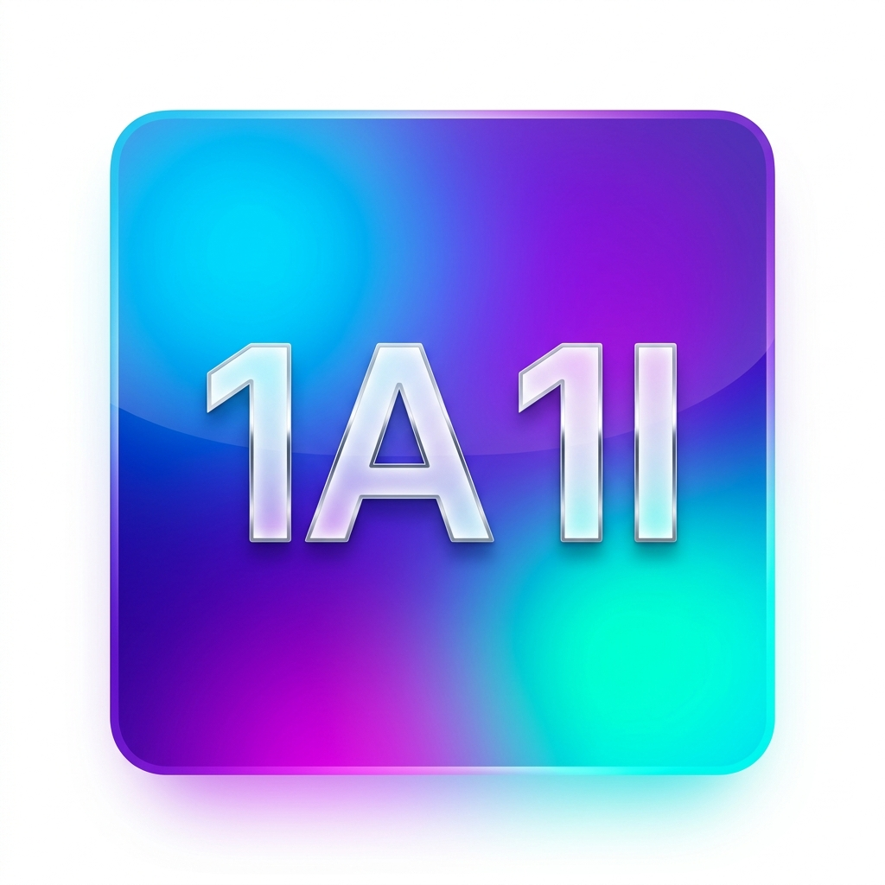

# 👑 Sarah IA — Moteur IA Local Souverain & Multi-Agents iOS

  
  <h3>Sarah IA — L'Intelligence Artificielle Locale & Souveraine pour iOS</h3>
  
<em>Interface Universelle 100% Identique — De l'iPhone 5s (iOS 12.0) à l'iPhone 17+ (iOS 18.0+)</em>

---

## 🌟 Présentation

[Site de téléchargement iPhone](https://200012yoel.github.io/SarahAI/) · [Dernière version publiée](https://github.com/200012Yoel/SarahAI/releases/latest)

**Sarah IA** est une application d'assistance intelligente et autonome pour iOS, conçue pour fonctionner **100% en local et hors-ligne**. 
Elle intègre une **architecture adaptative multi-matérielle** qui ajuste en temps réel la puissance du modèle, la gestion de la mémoire et la cadence de streaming selon la génération exacte de l'iPhone.

---

## 👥 L'équipe des 4 agents visibles

L'orchestration est pilotée par **Sarah**. Les anciens profils Nathan et Tom sont regroupés dans Sarah ; le profil développeur est présenté sous le nom **Raphaël**.

| Agent | Rôle & Spécialité | Couleur & Thème | Fonctionnalités Clés |
|:---|:---|:---:|:---|
| 👑 **Sarah** | **Pilote et assistante générale** | Rose Néon / Couronne | Orchestration, mémoire locale, réseaux sociaux, médias, histoire et géopolitique. |
| 💻 **Raphaël** | **Développeur** | Vert Cyber / Matrix | Sites Web, HTML/CSS/JS, code iOS et SwiftUI. |
| 🇮🇱 **Yoann** | **Traducteur Hébreu ⇄ Français** | Or & Ambre | Dictionnaire expert bilingue, phonétique, racines sémitiques, grammaire et expressions idiomatiques. |
| ✨ **Ethel** | **Intelligence Créative & Spécialisée** | Bleu & Rouge | Agent féminin polyvalent pour les modules créatifs et graphiques. |

---

## 🏛️ Architecture Technique de "Sarah Engine"

### 1. 🧠 Inférence Adaptative & Profilage RAM (Zero Crash OOM)
- **$\ge$ 6 Go RAM (iPhone 14/15/16/17+)** : Modèles 1.5B/3B Q4_K_M (MLX Swift / Core ML / Metal).
- **2 à 4 Go RAM (iPhone 7 à 11)** : Micro-modèles 0.5B Q4_0 (llama.cpp / ARM NEON).
- **$\le$ 1 Go RAM (iPhone 5s / 6 / iOS 12)** : Inférence locale désactivée et bascule automatique sur l'**API Cloud Fallback** (0 crash Jetsam OOM).
- **Model Identity Privacy Shield** : Masquage total des noms de modèles bruts (Ollama, Llama, Qwen, Mistral) sous l'identité incarnée de Sarah.

### 2. 🎙️ Moteur Vocal & Visualiseur RMS 60 FPS
- **Extraction d'Onde non-bloquante** : Tap sur `AVAudioEngine.inputNode` (bus 0) adapté dynamiquement au format matériel (Bluetooth mono 16 kHz / micro 48 kHz), calcul RMS et rafraîchissement 60 FPS via `CADisplayLink`.
- **Pipeline STT & Traduction** : Whisper.cpp (Tiny Int8) + `SFSpeechRecognizer` avec moteur lexical `YohanLexiconEngine`.
- **TTS HD** : `AVSpeechSynthesizer` avec voix neuronales haute fidélité.

### 3. 💬 Appels vocaux WebRTC
- Appels vocaux chiffrés de bout en bout et traduction vocale en direct.

### 4. 🗄️ Persistance SQLite WAL & Timeout d'Inactivité (1h)
- Base SQLite native en mode **Write-Ahead Logging (`PRAGMA journal_mode = WAL;`)** avec index B-Tree sur `(conversation_id, timestamp DESC)` pour des lectures en $< 2\text{ ms}$.
- **SessionTimeoutManager** : Si l'app reste fermée ou en arrière-plan $\ge 3600\text{ s}$ (1 heure), la session active est archivée et un nouveau chat vierge avec un UUID unique est généré.
- **BackgroundModelDownloader** : `URLSessionConfiguration.background` avec support de reprise (`resumeData`).

### 5. 💻 Live Preview Développeur Isolé (Dynamic Island)
- Écran virtuel (`index.html`) réservé à l'Agent Développeur.
- Injection via `DevCodeInjector` dans une `<iframe sandbox="allow-scripts allow-same-origin allow-forms">` avec Safe Areas et scrolling vertical autonome (`overflow-y: auto`, `overflow-x: hidden`).
- Purge de cache `WKWebsiteDataStore.nonPersistent()` et Watchdog Timeout de 5.0 secondes.

---

## 📱 Compatibilité Universelle

* **Binaire Universel** : `SarahIA.ipa` (~20.7 Mo)
* **Systèmes supportés** : iOS 12.0, iOS 13.0, iOS 14.0, iOS 15.0, iOS 16.0, iOS 17.0, iOS 18.0+
* **Appareils compatibles** : De l'iPhone 5s à l'iPhone 17 Pro Max.
* **Outils d'installation** : Sideloadly, AltStore, TrollStore, Xcode.
